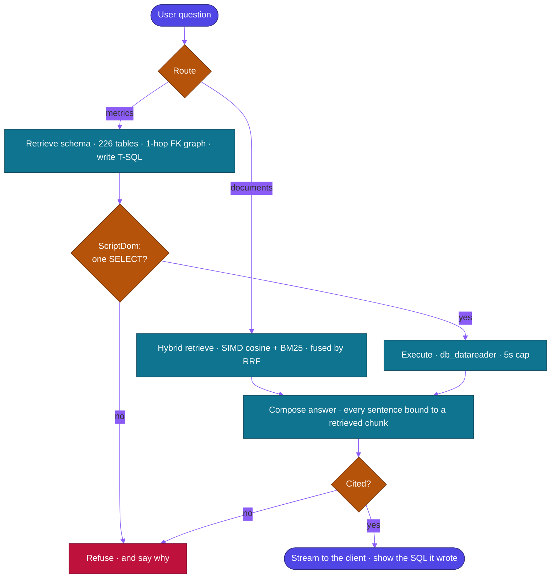
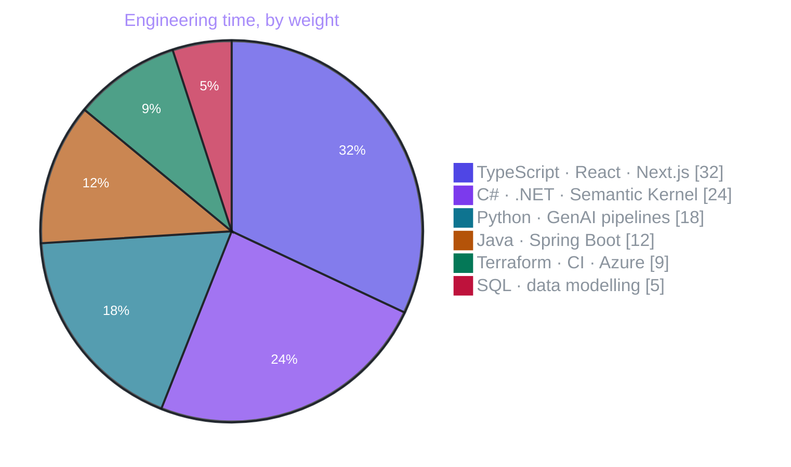
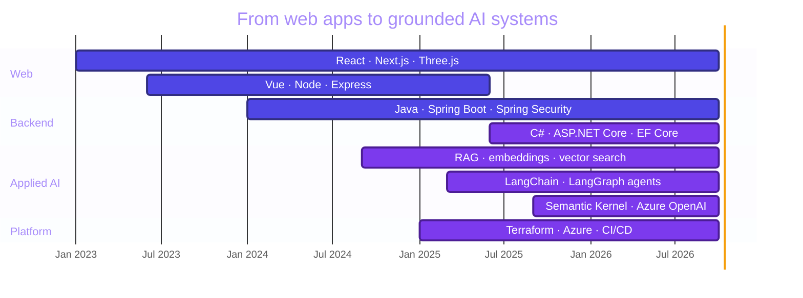

<div align="center">


<a href="https://www.mhdmansouri.com/">
  
</a>

<br/>

<a href="https://www.mhdmansouri.com/"></a>
<a href="https://www.linkedin.com/in/mehdi-mansouri-/"></a>
<a href="https://github.com/PoliTo-Rocket-Team"></a>


</div>

---

## ◆ About

```ts
const saoshyant = {
  role:      ["Full Stack Software Engineer", "Applied AI Engineer"],
  based:     "Turin, Italy 🇮🇹",
  studying:  "Computer Engineering @ Politecnico di Torino",
  buildsWith:["Next.js", "React", "Three.js", "C# / .NET 10", "Java + Spring", "Python"],
  focus:     "retrieval-grounded AI systems that cite every claim they make",
  currently: "Quayside — hybrid RAG + NL-to-SQL over a 226-table schema on Azure",
  principle: "no source, no claim — degrade visibly instead",
} as const;
```

<table>
<tr>
<td width="50%" valign="top">

**What I like building**

- 🧠 Retrieval pipelines that refuse to hallucinate
- 🕸 Agent graphs with explicit state and guardrails
- 🚀 Interfaces that feel fast — App Router, streaming, WebGL
- 🧱 Typed contracts from the database to the browser
- 🔁 Infrastructure that is a file, not a click

</td>
<td width="50%" valign="top">

**How I work**

- Dependencies point inward, I/O lives at the edges
- Generated SQL is parsed, never regex-matched
- `CancellationToken` plumbed all the way down
- Small files per concept, readable in one sitting
- Terraform + CI from day one, not after the demo

</td>
</tr>
</table>

---

## ◆ Tech Stack

<div align="center">

#### Languages


#### Generative AI &nbsp;·&nbsp; Agents &nbsp;·&nbsp; RAG


<br/>


#### Frontend


#### Backend


#### Data


#### Cloud &nbsp;·&nbsp; DevOps


</div>

---

## ◆ How I Put a System Together

```mermaid
%%{init: {'theme':'base','themeVariables':{'fontFamily':'ui-sans-serif, system-ui','fontSize':'14px','lineColor':'#8B5CF6','clusterBorder':'#8B5CF6','clusterBkg':'transparent','titleColor':'#A78BFA','textColor':'#8B949E'}}}%%
flowchart LR
    subgraph EXP["🖥 Experience"]
        direction TB
        A1["Next.js 15 · App Router"]
        A2["React 19 · TypeScript"]
        A3["Three.js · D3 · Tailwind v4"]
    end
    subgraph SVC["⚙ Services"]
        direction TB
        B1["ASP.NET Core · C# 14"]
        B2["Java · Spring Boot"]
        B3["Node · Express"]
    end
    subgraph INT["🧠 Intelligence"]
        direction TB
        C1["LangChain · LangGraph"]
        C2["Semantic Kernel · tool calling"]
        C3["Hybrid RAG · RRF · citations"]
    end
    subgraph DAT["🗄 Data"]
        direction TB
        D1["Azure SQL · VECTOR 1536-d"]
        D2["PostgreSQL · MongoDB"]
        D3["RabbitMQ · Databricks"]
    end
    subgraph OPS["☁ Platform"]
        direction TB
        E1["Azure Container Apps"]
        E2["Terraform · Docker"]
        E3["GitHub Actions · Vercel"]
    end

    EXP ==> SVC ==> INT ==> DAT
    SVC --> OPS
    INT --> OPS
    DAT --> OPS

    classDef exp fill:#4F46E5,stroke:#312E81,stroke-width:1px,color:#FFFFFF
    classDef svc fill:#7C3AED,stroke:#4C1D95,stroke-width:1px,color:#FFFFFF
    classDef int fill:#0E7490,stroke:#164E63,stroke-width:1px,color:#FFFFFF
    classDef dat fill:#B45309,stroke:#78350F,stroke-width:1px,color:#FFFFFF
    classDef ops fill:#047857,stroke:#064E3B,stroke-width:1px,color:#FFFFFF
    class A1,A2,A3 exp
    class B1,B2,B3 svc
    class C1,C2,C3 int
    class D1,D2,D3 dat
    class E1,E2,E3 ops
```



---

## ◆ The Shape of an Agent I Trust

A grounded pipeline has to be allowed to say *no*. Both branches below end in a refusal
path, and nothing reaches the client that isn't traceable to a retrieved source.



---

## ◆ Charts

<div align="center">


</div>

### Where the hours go



### Focus over time



---

## ◆ Featured Work

<div align="center">

<a href="https://github.com/saoshyant-mansouri/quayside">
  
</a>
<a href="https://github.com/saoshyant-mansouri/klipsan-backend">
  
</a>
<a href="https://github.com/saoshyant-mansouri/genetic-data-visualization-d3-databricks">
  
</a>
<a href="https://github.com/saoshyant-mansouri/yakkyofy-e-commerce-demo---vue.Js---rabbitmq---stripe---paypal">
  
</a>
<a href="https://github.com/saoshyant-mansouri/solar-system-3d">
  
</a>
<a href="https://github.com/saoshyant-mansouri/ai-chat-app">
  
</a>

</div>

| Project | What it is | Stack |
|:--|:--|:--|
| **[Quayside](https://github.com/saoshyant-mansouri/quayside)** | Retrieval-grounded assistant that answers only from public source material and cites every claim. Hybrid RAG with SIMD vector search, and NL→SQL over a 226-table schema validated by a real T-SQL parser. |      |
| **[Klipsan](https://github.com/saoshyant-mansouri/klipsan-backend)** | Auth server for an enterprise platform — Spring Security wired to a Next.js front end for secure data handling. |    |
| **[Genetic Data Viz](https://github.com/saoshyant-mansouri/genetic-data-visualization-d3-databricks)** | Interactive exploration of genomic data, Databricks for the pipeline and D3 for the picture. |    |
| **[E-commerce Architecture Demo](https://github.com/saoshyant-mansouri/yakkyofy-e-commerce-demo---vue.Js---rabbitmq---stripe---paypal)** | Event-driven storefront: message queue between services, two payment providers behind one checkout. |     |
| **[Solar System 3D](https://github.com/saoshyant-mansouri/solar-system-3d)** | WebGL orrery — real orbital maths, 60fps in the browser. |   |
| **[AI Chat App](https://github.com/saoshyant-mansouri/ai-chat-app)** | Streaming chat interface over an LLM backend, built to feel instant. |   |

---

<div align="center">

### ◆ Let's build something

<a href="https://www.mhdmansouri.com/"></a>
<a href="https://www.linkedin.com/in/mehdi-mansouri-/"></a>

<br/><br/>

<i>No source, no claim.</i>


</div>
